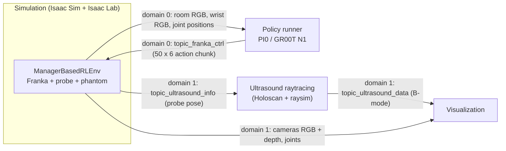

# Rehearsal plan: Robotic Ultrasound review

Practice workflow for the Monday review. It covers what the reviewer asked for:
walk through the key Python scripts, explain how the components interact, run a live demo,
and make a few small script changes while showing their effect.

Everything below points at real files in this repo (branch `docker-v0.5.0`, based on `v0.5.0`).
Items marked **(verify)** are my reading of the code and have not been run. Check them on the VM before Monday.

Suggested budget: three sessions of 30 to 45 minutes, then one full timed run-through.

---

## 0. Setup for every session

1. Bring up the VM with `RUNBOOK.md` (display check, Docker check, firewall rules, `HOLOHUB_ALWAYS_BUILD=false`).
2. Work on a throwaway branch, so every experiment can be undone in one command:
   ```bash
   cd ~/i4h-workflows && git switch -c rehearsal
   # undo all edits at any time:  git checkout -- . && git status
   ```
3. Use four tmux windows: **sim**, **policy**, **viz**, **shell** (for logs, edits, `docker ps`, `docker stop`).
   Start containers only from tmux, and stop them with `docker stop $(docker ps -q)`, never Ctrl-Z.
4. Editor: use `micro` on the VM (friendlier than nano, with the usual shortcuts):
   ```bash
   apt-get install -y micro
   echo 'export S=~/i4h-workflows/workflows/robotic_ultrasound/scripts' >> ~/.bashrc && source ~/.bashrc
   ```
   | Keys | Action |
   |---|---|
   | `Ctrl-S` / `Ctrl-Q` | Save / quit |
   | `Ctrl-Z` / `Ctrl-Y` | Undo / redo |
   | `Ctrl-F`, then `Ctrl-N` | Find, then next match |
   | `Ctrl-L` | Jump to a line number |
   | `Ctrl-/` | Comment or uncomment the line |
   | `Ctrl-G` | Built-in help with all bindings |

   Open a file at a line with `micro +245 $S/simulation/environments/sim_with_dds.py` (if `+LINE` does not work, press `Ctrl-L`).
   As a fallback, VS Code on your laptop with the Remote-SSH extension edits the same files on the VM.

---

## Session A: Baseline, and why the screen "freezes" (30 min)

**Read this first: the simulation blocks until the policy answers.**
In `scripts/simulation/environments/sim_with_dds.py` lines 354-359:

```python
ret = None
while ret is None:
    ret = infer_reader.read_data()
    infer_r_cam_writer.write(); infer_w_cam_writer.write(); infer_pos_writer.write()   # re-publish while waiting
```

Whenever the action plan is empty, the sim publishes its observations and then **spins in this loop until a
policy message arrives**. So:

- `sim_env` on its own: the robot does its 40 reset steps (a little motion), then nothing moves and the GPU goes idle.
  This looks like a freeze, but it is the sim waiting for a policy. This matches the symptom you saw.
- The same happens if the policy is still loading its checkpoint (first run downloads it), if DDS traffic is blocked
  (firewall), or if the policy uses a different `--domain_id` than the sim.

Drills:

- [ ] Run `sim_env` alone. Confirm: brief motion, then idle GPU (`nvidia-smi`). Explain it in one sentence.
- [ ] Start `pi0_policy` in the second window. Watch the sim start moving once the first inference returns.
- [ ] Run `full_pipeline`. Identify the four windows/processes (sim, policy, ultrasound raytracing, visualization).
- [ ] Stop everything cleanly and check `docker ps` is empty.

---

## Session B: Architecture and code walkthrough (45 min)

### The four processes

| Process | Entry point | Role |
|---|---|---|
| Simulation | `scripts/simulation/environments/sim_with_dds.py` | Isaac Sim + Isaac Lab environment. Renders cameras, steps physics, publishes observations, executes actions |
| Policy | `scripts/policy/run_policy.py` | Loads PI0 (or GR00T N1), receives observations, returns action chunks |
| Ultrasound simulator | `scripts/simulation/examples/ultrasound_raytracing.py` | Holoscan app. Turns the probe pose into a simulated B-mode image with GPU ray tracing (`raysim`) |
| Visualization | `scripts/utils/visualization.py` | Dear PyGui window. Shows camera feeds and the ultrasound image |

They are separate processes that talk only through DDS (RTI Connext).

### Data flow



### Topics and schemas

| Topic | Domain | From, to | Schema (`scripts/dds/schemas/`) |
|---|---|---|---|
| `topic_room_camera_data_rgb`, `topic_wrist_camera_data_rgb` | 0 and 1 | sim to policy (0), sim to viz (1) | `CameraInfo` (224x224 uint8 RGB in `data`) |
| `topic_room_camera_data_depth`, `topic_wrist_camera_data_depth` | 1 | sim to viz | `CameraInfo` |
| `topic_franka_info` | 0 and 1 | sim to policy, sim to viz | `FrankaInfo` (`joints_state_positions`) |
| `topic_franka_ctrl` | 0 | policy to sim | `FrankaCtrlInput` (`joint_positions` field carries the action chunk) |
| `topic_ultrasound_info` | 1 | sim to raytracing | `UltraSoundProbeInfo` (position, orientation) |
| `topic_ultrasound_data` | 1 | raytracing to viz | `UltraSoundProbeData` (**verify** the exact name; the README says `..._rgb`, the code default is `topic_ultrasound_data`) |

Domain 0 is the control loop (sim and policy). Domain 1 is for visualization and the ultrasound simulator.
Publishers and subscribers are thin wrappers in `scripts/dds/publisher.py` and `scripts/dds/subscriber.py`.
Schemas are generated from IDL and must not be edited by hand.

### Walk through the code in this order

1. **`sim_with_dds.py`**
   - Lines 45-121: arguments, topic names, `--infer_domain_id 0`, `--viz_domain_id 1`.
   - Lines 153-204: publisher classes (room camera, wrist camera, joint positions, probe pose).
   - Lines 296-373: the main loop. Per step: capture cameras, read joints, compute the probe pose through the frame chain
     mesh to organ to end effector to ultrasound (line 338), publish visualization topics, and if the action plan is empty,
     publish inference inputs and wait for the policy (354-359). Then take the first `replan_steps` (5) actions of the chunk
     (line 363) and apply one per `env.step` (373).
   - Constants worth knowing: `hz = 30` (150), `max_timesteps = 250` (245), `reset_steps = 40` (263), `replan_steps = 5` (287).
2. **Environment definition** (`scripts/simulation/exts/robotic_us_ext/robotic_us_ext/`)
   - Task registration: `tasks/ultrasound/approach/config/franka/__init__.py` line 40,
     id `Isaac-Teleop-Torso-FrankaUsRs-IK-RL-Rel-v0`.
   - `config/teleop/ik_rel_env_cfg.py`, class `ModFrankaUltrasoundTeleopEnv` (line 36): the robot
     (`FRANKA_PANDA_REALSENSE_ULTRASOUND_CFG`), the **action term** (`DifferentialInverseKinematicsActionCfg`,
     relative pose, `dls` IK, body `TCP`, `scale=1.0` at line 51), the **wrist camera** (224x224, on the D405 color camera)
     and the **room camera** (224x224, position at line 109).
   - `config/franka/franka_manager_rl_env_cfg.py`: the scene (`RoboticSoftCfg`, line 53: ground, table, `organs` phantom at
     `[0.6, 0.0, 0.09]`, frame transforms), observation groups, rewards (not used by the policy at run time),
     reset events (`EventCfg`, line 315: the phantom is randomized by up to 0.15 m in x and y on each reset).
   - `lab_assets/franka.py`: the robot asset. Joint stiffness 400 and damping 80 (lines 187-190).
3. **`policy/run_policy.py`**
   - Lines 168-191: `dds_callback` collects room image, wrist image, and joints. When all three are present it calls
     `writer.write(...)`, which runs inference (`produce`, lines 142-164) and publishes the result.
   - `policy.infer(room_img, wrist_img, current_state=joint_pos[:7])` at line 148: the observation is two images,
     seven joint positions, and a text prompt (`--task_description`, default "Perform a liver ultrasound.").
   - Output: `actions` reshaped to `chunk_length * 6` (lines 156-163). Default `--chunk_length 50`, and 16 for GR00T N1.
   - `policy/pi0/runners.py`: wraps `openpi` (`create_trained_policy`, then `infer` with `observation/image`,
     `observation/wrist_image`, `observation/state`, `prompt`).
4. **`teleop_se3_agent.py`** (manual control)
   - Keyboard to a 6-D delta pose (`pos_sensitivity=0.05`, `rot_sensitivity=0.15`, times `--sensitivity`),
     converted to `[delta_pos, axis-angle]` and passed to `env.step`. Same 6-D relative action space as the policy.
   - It runs at a fixed 30 Hz and does **not** wait for anything. It publishes camera and probe data for visualization only.
   - The keyboard help is printed at startup. `L` resets the environment.

### Manual control vs policy control (the assignment asks for this)

- Both end up as a **6-D relative end-effector pose command** into the same Isaac Lab IK action term.
- **Manual:** a human presses keys, the script runs at 30 Hz, and no DDS is involved in control.
- **Policy:** closed loop over DDS. The sim publishes camera images and joints, blocks, the policy returns a chunk of 50 actions,
  the sim applies the first 5 and asks again (receding horizon).
- **(verify)** that the policy's action convention matches the teleop one (position delta plus rotation delta). The training
  data conversion is in `scripts/training/convert_hdf5_to_lerobot.py`.

---

## Session C: Live-change drills (45 min)

### The edit loop (use it for every drill)

1. Open the file at the right line (no scrolling in front of the reviewers), for example:
   ```bash
   micro +245 $S/simulation/environments/sim_with_dds.py      # max_timesteps
   micro +287 $S/simulation/environments/sim_with_dds.py      # replan_steps
   micro +365 $S/simulation/environments/sim_with_dds.py      # where to add print(t, action)
   micro +104 $S/policy/run_policy.py                         # --verbose
   ```
2. Make the change, `Ctrl-S`, `Ctrl-Q`.
3. In the shell: `git diff`. Read the change out loud.
4. Restart the mode (`docker stop $(docker ps -q)` first, then `./i4h run ...` again). No image rebuild is needed.
5. Show the effect, then `git checkout -- .` to undo.

Practice the whole loop until each drill takes under two minutes.

### C0. First, check that your edits reach the container (10 min, do this before anything else)

`./i4h run` mounts your repo at `/workspace/i4h` and puts `<repo>/workflows/robotic_ultrasound/scripts` first on `PYTHONPATH`.
So edits to files under `scripts/` (`sim_with_dds.py`, `run_policy.py`, `dds/`, `policy/`, `utils/`) should take effect.

But the `robotic_us_ext` package (the environment, robot, and camera configs) was installed in the image with
`pip install -e` **from the image's own copy** (`/workspace/i4h-workflows/...`), so edits to the extension files on the host
**may not be picked up (verify)**.

Test both, with a marker print at the top of each file:
```bash
S=workflows/robotic_ultrasound/scripts
# 1. a scripts/ file (insert at the top, so it prints at start-up)
sed -i '16i print("MARKER sim_with_dds edited")' $S/simulation/environments/sim_with_dds.py
# 2. an extension file (module level, prints when the config is imported)
echo 'print("MARKER ext edited")' >> $S/simulation/exts/robotic_us_ext/robotic_us_ext/tasks/ultrasound/approach/config/teleop/ik_rel_env_cfg.py
./i4h run robotic_ultrasound sim_env --as-root
```
Look for the two `MARKER` lines in the start-up output. Then stop it from another tmux window
(`docker stop $(docker ps -q)`) and undo the edits with `git checkout -- .`.

- If both markers appear, every drill below works.
- If only the first appears, use the **scripts/ drills** (1-6) for the live demo, and only explain the extension drills (7-9).
  This is also a good debugging story: explain why (editable install points at the image copy) and how you would fix it
  (add the mounted extension folder to `PYTHONPATH` ahead of the install, or reinstall it in place inside the container).

### Drills in `scripts/` (safe, fast to explain)

| # | Change | File and line | What to observe (expected, **verify**) |
|---|---|---|---|
| 1 | Shorten the episode: `max_timesteps = 250` to `80` | `sim_with_dds.py:245` | Episodes end sooner. The robot returns to the setup pose (40 reset steps), then a new episode starts. Explains the episode loop |
| 2 | Re-plan more or less often: `replan_steps = 5` to `1`, then to `25` | `sim_with_dds.py:287` | With 1, the policy is queried every step (slower wall clock, follows fresh observations). With 25, it runs mostly open loop between queries. Explains the receding horizon |
| 3 | Print the command: add `print(t, action)` after `action = action_plan.popleft()` | `sim_with_dds.py:365` | Shows the 6-D relative pose command per step. Good for the "what does the policy output" question |
| 4 | Show the DDS traffic: run the policy with `--verbose True` | `policy/run_policy.py:104` (CLI), e.g. `./i4h run robotic_ultrasound pi0_policy --as-root --run-args="--verbose True"` | Log lines for every message received and published. Note the argument uses `type=bool`, so any non-empty string means true |
| 5 | Change the prompt: `--task_description "..."` | `run_policy.py:46` | Language-conditioned policy. Try a different sentence and see whether behavior changes (likely little if the model was fine-tuned on one prompt) |
| 6 | Teleop speed: `--sensitivity 3` | `teleop_se3_agent.py:48, 275` | Keyboard moves and rotations scale. Shows manual control needs no policy |

### Drills in the extension (only if C0 showed that the extension edits reach the container)

| # | Change | File and line | What to observe (expected, **verify**) |
|---|---|---|---|
| 7 | Action scale: `scale=1.0` to `0.5` | `ik_rel_env_cfg.py:51` | The same policy commands move the arm half as far per step. Explains the action semantics |
| 8 | Reset randomization: phantom `pose_range` x, y from `(-0.15, 0.15)` to `(0, 0)` (or to `(-0.3, 0.3)`) | `franka_manager_rl_env_cfg.py:344` | Fixed phantom placement, or a harder case for the policy. Explains the reset events |
| 9 | Move the room camera: change `pos=(0.55942, 0.56039, 0.36243)` | `ik_rel_env_cfg.py:109` | The room image seen by the policy and the visualization changes. Explains sensors as policy inputs |

### Break-and-fix drills (the reviewer asked about debugging)

- [ ] **Wrong chunk length.** Run the policy with `--chunk_length 16` for PI0 (the default is 50).
      Expect a reshape `ValueError` at `run_policy.py:156-163`. Explain the cause (the model returns its own horizon, the
      reshape assumes `chunk_length * 6`) and fix it (use the model's horizon, or slice). GR00T N1 uses 16 by design.
- [ ] **Wrong DDS domain.** Start the policy with `--domain_id 5`. The sim never gets a reply and blocks (Session A).
      Explain how you would find it: `--verbose True`, `docker ps`, `nvidia-smi`, and the topic names and domains in both files.
- [ ] **Swap the policy.** Run `gr00tn1_policy` (mode in `metadata.json`) instead of `pi0_policy`. The DDS interface is
      unchanged, which shows how policies plug in.

After each drill: `git diff`, explain what you changed and why, then `git checkout -- .`.

---

## Session D: Question rehearsal (30 min)

Answer each out loud in under a minute, with the file to open.

| Question | Short answer and where to look |
|---|---|
| What is Isaac Sim responsible for? | Physics (PhysX), RTX rendering and cameras, robot articulation. Isaac Lab wraps it as a Gym environment (`ManagerBasedRLEnv`) with scene, actions, observations, events |
| How is the robot represented? | A USD asset (Franka Panda with ultrasound probe and D405 camera) configured as an `ArticulationCfg` in `lab_assets/franka.py` with PD actuators (stiffness 400, damping 80). Driven by an IK action term on the `TCP` frame |
| What observations does the policy get? | Room RGB, wrist RGB (224x224), the seven arm joint positions, and a text prompt (`run_policy.py:148`) |
| What actions does it produce? | A chunk of 50 steps (PI0) of 6-D relative end-effector pose commands. The sim applies the first 5, then re-queries |
| How does information flow? | The sim publishes on DDS domain 0, blocks, the policy answers on `topic_franka_ctrl`. Visualization data goes on domain 1 |
| What do the cameras do? | The room and wrist cameras are the policy's eyes. They also feed the visualization. The probe pose drives the ultrasound simulator |
| How is communication implemented? | RTI Connext DDS with the Python API: IDL-generated schemas, `Publisher` and `Subscriber` wrappers, 30 Hz, two domains. Needs a license and multicast allowed in the firewall (UDP 7400-7401 to 239.255.0.1) |
| Where would you add a different robot? | New asset in `lab_assets/`, a new env cfg like `ik_rel_env_cfg.py` (actions, cameras), register the task in `config/.../__init__.py`, adjust the joint counts (`joint_pos[:7]`, action dims) |
| A different environment? | `RoboticSoftCfg` in `franka_manager_rl_env_cfg.py` (scene assets, paths in `simulation/utils/assets.py`) |
| A different sensor? | Add the sensor cfg in the env cfg, capture it in `sim_with_dds.py`, add a publisher, and a schema in `dds/schemas/` |
| A different policy? | New runner in `policy/<name>/runners.py` with `infer(...)`, one branch in `run_policy.py`. The DDS interface stays the same |
| How would you run the sim on a workstation and the policy on a Jetson or DGX Spark? | DDS already separates them. Run `run_policy.py` on the other device on the same domain, and make sure discovery works across the network (multicast, or explicit peers in RTI). Two 224x224x3 images at 30 Hz is about 9 MB/s (more while the sim re-publishes during its wait), so a LAN is fine. Watch latency (the sim blocks on each inference) and whether the model fits the device's memory |

---

## Session E: Timed run-through (20 min)

Practice the whole thing once, with a timer:

| Time | Content |
|---|---|
| 0:00 | One slide: architecture diagram (the Mermaid chart above, redrawn) and the data flow in three sentences |
| 2:00 | Live: bring up the full pipeline. Point out the four windows |
| 5:00 | Code walkthrough: `sim_with_dds.py` loop, `run_policy.py` callback, DDS wrappers, env cfg |
| 10:00 | Live changes: drills 2 and 3, plus one break-and-fix |
| 15:00 | Troubleshooting stories (below) |
| 18:00 | Where I would extend it, and the Jetson / DGX Spark split |

**Troubleshooting stories to have ready** (issue, diagnosis, resolution, what next):
1. Warp version mismatch broke Isaac Sim extensions (`warp.types` errors). `pip show warp-lang` traced it to an unpinned `isaaclab` dependency. Pinned 1.8.1.
2. No Vulkan window on container desktops. `vkcube` and `nvidia-smi` showed `Xvfb` instead of a GPU-backed Xorg. Moved to a VM.
3. Docker export failed with "no space left". A second `chmod -R` duplicated the conda layer. Removed it, bigger disk.
4. HoloHub CLI broke (`holohub.py` missing). Upstream restructured. Pinned the release-era commit.
5. Sim "freezes" with the GPU idle. It blocks until the policy replies (firewall for DDS, or the policy not running).
6. VM crash from a GPU hang. Found in the previous boot's kernel log (`journalctl -b -1 -k`).

---

## Before Monday

- [ ] Keep a recorded demo as a backup, and know how to say what is on it.
- [ ] Bring the VM up at least an hour early. Do the display and Docker checks, start the pipeline once.
- [ ] Be on a clean branch (`git status` empty, or the `rehearsal` branch) so a stray edit cannot surprise you.
- [ ] Practice the stop commands: `docker ps`, `docker stop $(docker ps -q)`.
- [ ] Decide which drills you will do live, and rehearse each twice with the `micro` edit loop (open at a line, edit,
      save, `git diff`, restart, show, revert).
- [ ] Redraw the Mermaid diagram as a clean slide.
