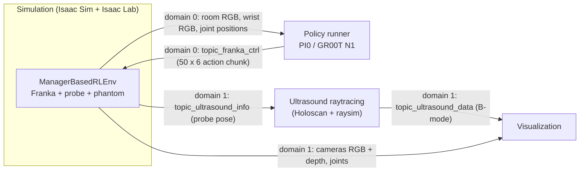
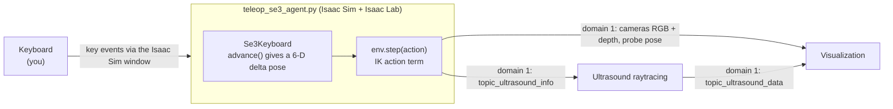

# Rehearsal plan: Robotic Ultrasound review

Practice workflow for the Monday review. It covers what the reviewer asked for:
walk through the key Python scripts, explain how the components interact, run a live demo,
and make a few small script changes while showing their effect.

Everything below points at real files in this repo (branch `docker-v0.5.0`, based on `v0.5.0`).
Items marked **(verify)** are my reading of the code and have not been run. Check them on the VM before Monday.

Suggested budget: three sessions of 30 to 45 minutes, then one full timed run-through.

---

## 0. Setup for every session

1. Bring up the VM with `RUNBOOK.md` (display check, Docker check, firewall rules, `HOLOHUB_ALWAYS_BUILD=false`).
2. Work on a throwaway branch, so every experiment can be undone in one command:
   ```bash
   cd ~/i4h-workflows && git switch -c rehearsal
   # undo all edits at any time:  git checkout -- . && git status
   ```
3. Use four tmux windows: **sim**, **policy**, **viz**, **shell** (for logs, edits, `docker ps`, `docker stop`).
   Start containers only from tmux, and stop them with `docker stop $(docker ps -q)`, never Ctrl-Z.
4. Editor: use `micro` on the VM (friendlier than nano, with the usual shortcuts):
   ```bash
   apt-get install -y micro
   echo 'export S=~/i4h-workflows/workflows/robotic_ultrasound/scripts' >> ~/.bashrc && source ~/.bashrc
   ```
   | Keys | Action |
   |---|---|
   | `Ctrl-S` / `Ctrl-Q` | Save / quit |
   | `Ctrl-Z` / `Ctrl-Y` | Undo / redo |
   | `Ctrl-F`, then `Ctrl-N` | Find, then next match |
   | `Ctrl-L` | Jump to a line number |
   | `Ctrl-/` | Comment or uncomment the line |
   | `Ctrl-G` | Built-in help with all bindings |

   Open a file at a line with `micro +245 $S/simulation/environments/sim_with_dds.py` (if `+LINE` does not work, press `Ctrl-L`).
   As a fallback, VS Code on your laptop with the Remote-SSH extension edits the same files on the VM.

---

## Helper: exploring the image and searching with grep

### Get a shell inside the image (a throwaway container)

```bash
# plain shell, nothing else started (changes are lost on exit)
docker run --rm -it --entrypoint bash i4h_build-robotic_ultrasound:docker-v0-5-0

# same, with your repo mounted and the GPU available
docker run --rm -it --gpus all --runtime=nvidia --entrypoint bash \
  -v ~/i4h-workflows:/workspace/i4h i4h_build-robotic_ultrasound:docker-v0-5-0

# copy a folder out to read it in an editor (no shell needed)
docker create --name tmp i4h_build-robotic_ultrasound:docker-v0-5-0
docker cp tmp:/workspace/i4h-workflows/third_party/IsaacLab/source ./IsaacLab-source
docker rm tmp
```

Leave with `exit`. In an **interactive** shell, `~/.bashrc` activates conda's `base` environment, which has almost none of the packages
(so `pip list | grep isaac` finds nothing). Run `conda activate robotic_ultrasound` first, or start the shell with `bash --norc`.
A non-interactive command (`docker run ... --entrypoint bash -c "..."`) does not read `.bashrc` and already uses the right environment.
Do not start the model or the sim in an exploring shell if RAM is tight.

Where things are inside the image:

| Path | What |
|---|---|
| `/workspace/i4h-workflows/` | The repo as built into the image |
| `/workspace/i4h-workflows/third_party/IsaacLab/` | Isaac Lab (`source/isaaclab/isaaclab/...`) |
| `/workspace/i4h-workflows/third_party/openpi`, `Isaac-GR00T`, `lerobot`, `i4h-sensor-simulation` | Policy and raysim code |
| `/opt/miniconda3/envs/robotic_ultrasound/lib/python3.11/site-packages/` | Installed packages (`isaacsim`, `holoscan`, `warp`, ...) |

### Find files by name

```bash
find /workspace/i4h-workflows/third_party/IsaacLab -name "se3_keyboard.py"     # exact name
find . -name "*.py" -path "*teleop*"                                            # pattern, limited to a path
ls -la; ls -R | head -50                                                        # list, recursive list
```

### grep cheat sheet

Pattern: `grep [options] "text" [where]`. Use `-r` to search folders, `-n` to show line numbers, and always give the folder (use `.` for the current one).

```bash
grep -rn "replan_steps" .                              # current folder and below
grep -rn "replan_steps" ~/i4h-workflows/workflows      # a specific folder
grep -rn "domain_id" --include="*.py" .                # only Python files
grep -rn "action_dim" --include="*.py" --exclude-dir=__pycache__ .
grep -rin "chunk_length" .                             # -i: ignore case
grep -rl "topic_franka_ctrl" .                         # -l: only the file names
grep -rc "replan" sim_with_dds.py                      # -c: count matching lines in a file
grep -n -B3 -A3 "replan_steps = 5" sim_with_dds.py     # 3 lines before and after
grep -rnE "add_callback|Se3Keyboard" .                 # -E: regex, "a or b"
grep -rnF "policy.infer(" .                            # -F: plain text, special characters are literal
grep -rn "topic_" --include="*.py" . | head -20        # pipe to head to shorten the output
```

Options to remember: `-r` recurse, `-n` line numbers, `-i` ignore case, `-l` file names only, `-w` whole word, `-v` lines that do NOT match,
`-A/-B/-C N` lines of context, `-E` regex, `-F` literal text, `--include="*.py"` and `--exclude-dir=DIR` to narrow the search.

Examples for this workflow (run in `$S`, the scripts folder):

```bash
grep -rn "class Se3Keyboard" /workspace/i4h-workflows/third_party/IsaacLab/source --include="*.py"    # inside the image
grep -rn "set_joint_position_target" /workspace/i4h-workflows/third_party/IsaacLab/source --include="*.py"
grep -rn "topic_franka_ctrl" --include="*.py" $S                                                       # who uses this topic
```

Tips:

- In your git checkout, `git grep -n "replan_steps"` searches only tracked files and is fast.
- Quote the pattern (`"..."`) if it has spaces or special characters.
- Found a hit at `file:LINE`? Open it with `micro +LINE file`.

---

## Session A: Baseline, and why the screen "freezes" (30 min)

**Read this first: the simulation blocks until the policy answers.**
In `scripts/simulation/environments/sim_with_dds.py` lines 354-359:

```python
ret = None
while ret is None:
    ret = infer_reader.read_data()
    infer_r_cam_writer.write(); infer_w_cam_writer.write(); infer_pos_writer.write()   # re-publish while waiting
```

Whenever the action plan is empty, the sim publishes its observations and then **spins in this loop until a
policy message arrives**. So:

- `sim_env` on its own: the robot does its 40 reset steps (a little motion), then nothing moves and the GPU goes idle.
  This looks like a freeze, but it is the sim waiting for a policy. This matches the symptom you saw.
- The same happens if the policy is still loading its checkpoint (first run downloads it), if DDS traffic is blocked
  (firewall), or if the policy uses a different `--domain_id` than the sim.

Drills:

- [ ] Run `sim_env` alone. Confirm: brief motion, then idle GPU (`nvidia-smi`). Explain it in one sentence.
- [ ] Start `pi0_policy` in the second window. Watch the sim start moving once the first inference returns.
- [ ] Run `full_pipeline`. Identify the four windows/processes (sim, policy, ultrasound raytracing, visualization).
- [ ] Stop everything cleanly and check `docker ps` is empty.

---

## Session B: Architecture and code walkthrough (45 min)

Where to explore: work in `workflows/robotic_ultrasound/scripts/`, and go to `third_party/IsaacLab` (in the image, or on the VM)
only when you need to see what Isaac Lab does for you.

### The four processes

| Process | Entry point | Role |
|---|---|---|
| Simulation | `scripts/simulation/environments/sim_with_dds.py` | Isaac Sim + Isaac Lab environment. Renders cameras, steps physics, publishes observations, executes actions |
| Policy | `scripts/policy/run_policy.py` | Loads PI0 (or GR00T N1), receives observations, returns action chunks |
| Ultrasound simulator | `scripts/simulation/examples/ultrasound_raytracing.py` | Holoscan app. Turns the probe pose into a simulated B-mode image with GPU ray tracing (`raysim`) |
| Visualization | `scripts/utils/visualization.py` | Dear PyGui window. Shows camera feeds and the ultrasound image |

They are separate processes that talk only through DDS (RTI Connext).

### Data flow


```mermaid
flowchart LR
  subgraph SIM["Simulation (Isaac Sim + Isaac Lab)"]
    ENV["ManagerBasedRLEnv<br/>Franka + probe + phantom"]
  end
  POL["Policy runner<br/>PI0 / GR00T N1"]
  US["Ultrasound raytracing<br/>(Holoscan + raysim)"]
  VIZ["Visualization"]

  ENV -- "domain 0: room RGB, wrist RGB, joint positions" --> POL
  POL -- "domain 0: topic_franka_ctrl (50 x 6 action chunk)" --> ENV
  ENV -- "domain 1: topic_ultrasound_info (probe pose)" --> US
  US -- "domain 1: topic_ultrasound_data (B-mode)" --> VIZ
  ENV -- "domain 1: cameras RGB + depth, joints" --> VIZ
```

### Topics and schemas

| Topic | Domain | From, to | Schema (`scripts/dds/schemas/`) |
|---|---|---|---|
| `topic_room_camera_data_rgb`, `topic_wrist_camera_data_rgb` | 0 and 1 | sim to policy (0), sim to viz (1) | `CameraInfo` (224x224 uint8 RGB in `data`) |
| `topic_room_camera_data_depth`, `topic_wrist_camera_data_depth` | 1 | sim to viz | `CameraInfo` |
| `topic_franka_info` | 0 and 1 | sim to policy, sim to viz | `FrankaInfo` (`joints_state_positions`) |
| `topic_franka_ctrl` | 0 | policy to sim | `FrankaCtrlInput` (`joint_positions` field carries the action chunk) |
| `topic_ultrasound_info` | 1 | sim to raytracing | `UltraSoundProbeInfo` (position, orientation) |
| `topic_ultrasound_data` | 1 | raytracing to viz | `UltraSoundProbeData` (**verify** the exact name; the README says `..._rgb`, the code default is `topic_ultrasound_data`) |

Domain 0 is the control loop (sim and policy). Domain 1 is for visualization and the ultrasound simulator.
Publishers and subscribers are thin wrappers in `scripts/dds/publisher.py` and `scripts/dds/subscriber.py`.
Schemas are generated from IDL and must not be edited by hand.

### Walk through the code in this order

1. **`sim_with_dds.py`**
   - Lines 45-121: arguments, topic names, `--infer_domain_id 0`, `--viz_domain_id 1`.
   - Lines 153-204: publisher classes (room camera, wrist camera, joint positions, probe pose).
   - Lines 296-373: the main loop. Per step: capture cameras, read joints, compute the probe pose through the frame chain
     mesh to organ to end effector to ultrasound (line 338), publish visualization topics, and if the action plan is empty,
     publish inference inputs and wait for the policy (354-359). Then take the first `replan_steps` (5) actions of the chunk
     (line 363) and apply one per `env.step` (373).
   - Constants worth knowing: `hz = 30` (150), `max_timesteps = 250` (245), `reset_steps = 40` (263), `replan_steps = 5` (287).
2. **Environment definition** (`scripts/simulation/exts/robotic_us_ext/robotic_us_ext/`)
   - Task registration: `tasks/ultrasound/approach/config/franka/__init__.py` line 40,
     id `Isaac-Teleop-Torso-FrankaUsRs-IK-RL-Rel-v0`.
   - `config/teleop/ik_rel_env_cfg.py`, class `ModFrankaUltrasoundTeleopEnv` (line 36): the robot
     (`FRANKA_PANDA_REALSENSE_ULTRASOUND_CFG`), the **action term** (`DifferentialInverseKinematicsActionCfg`,
     relative pose, `dls` IK, body `TCP`, `scale=1.0` at line 51), the **wrist camera** (224x224, on the D405 color camera)
     and the **room camera** (224x224, position at line 109).
   - `config/franka/franka_manager_rl_env_cfg.py`: the scene (`RoboticSoftCfg`, line 53: ground, table, `organs` phantom at
     `[0.6, 0.0, 0.09]`, frame transforms), observation groups, rewards (not used by the policy at run time),
     reset events (`EventCfg`, line 315: the phantom is randomized by up to 0.15 m in x and y on each reset).
   - `lab_assets/franka.py`: the robot asset. Joint stiffness 400 and damping 80 (lines 187-190).
3. **`policy/run_policy.py`**
   - Lines 168-191: `dds_callback` collects room image, wrist image, and joints. When all three are present it calls
     `writer.write(...)`, which runs inference (`produce`, lines 142-164) and publishes the result.
   - `policy.infer(room_img, wrist_img, current_state=joint_pos[:7])` at line 148: the observation is two images,
     seven joint positions, and a text prompt (`--task_description`, default "Perform a liver ultrasound.").
   - Output: `actions` reshaped to `chunk_length * 6` (lines 156-163). Default `--chunk_length 50`, and 16 for GR00T N1.
   - `policy/pi0/runners.py`: wraps `openpi` (`create_trained_policy`, then `infer` with `observation/image`,
     `observation/wrist_image`, `observation/state`, `prompt`).
4. **`teleop_se3_agent.py`** (manual control)
   - Keyboard to a 6-D delta pose (`pos_sensitivity=0.05`, `rot_sensitivity=0.15`, times `--sensitivity`),
     converted to `[delta_pos, axis-angle]` and passed to `env.step`. Same 6-D relative action space as the policy.
   - It runs at a fixed 30 Hz and does **not** wait for anything. It publishes camera and probe data for visualization only.
   - The keyboard help is printed at startup. `L` resets the environment.

### Teleop data flow (`teleop_with_ultrasound` mode — the section-2 demo)


```mermaid
flowchart LR
  KB["Keyboard<br/>(you)"] -- "key events via the Isaac Sim window" --> SIM
  subgraph SIM["teleop_se3_agent.py (Isaac Sim + Isaac Lab)"]
    DEV["Se3Keyboard<br/>advance() gives a 6-D delta pose"] --> ENV["env.step(action)<br/>IK action term"]
  end
  ENV -- "domain 1: cameras RGB + depth, probe pose" --> VIZ["Visualization"]
  ENV -- "domain 1: topic_ultrasound_info" --> US["Ultrasound raytracing"]
  US -- "domain 1: topic_ultrasound_data" --> VIZ
```

The keyboard command is **not** sent over DDS — it never leaves the sim process. `Se3Keyboard.advance()` reads key
events straight from the Isaac Sim window and turns them into the same 6-D relative end-effector pose that
`env.step()` takes from the policy in the other mode. DDS (domain 1) only carries the *visualization* data outward:
camera feeds, probe pose, and the ultrasound image. This is the mode planned for the section-2 live demo/recording —
it hits every sub-bullet of "run the simulation" in one running process: robot interaction (the keyboard), cameras/
sensors (room + wrist feeds), and the ultrasound environment (the simulated B-mode image itself).

### Manual control vs policy control (the assignment asks for this)

- Both end up as a **6-D relative end-effector pose command** into the same Isaac Lab IK action term.
- **Manual:** a human presses keys, the script runs at 30 Hz, and no DDS is involved in control.
- **Policy:** closed loop over DDS. The sim publishes camera images and joints, blocks, the policy returns a chunk of 50 actions,
  the sim applies the first 5 and asks again (receding horizon).
- **(verify)** that the policy's action convention matches the teleop one (position delta plus rotation delta). The training
  data conversion is in `scripts/training/convert_hdf5_to_lerobot.py`.

### What the startup log tells you (`teleop_keyboard` mode, real output)

Isaac Lab prints its "managers" when the environment is created. Read them like a spec sheet:

| Manager | What the log shows | Meaning |
|---|---|---|
| Action | 1 term, `arm_action`, dimension **6** | 6-D relative end-effector pose command (`action_dim = 6`) |
| Observation | Group `policy`: `joint_pos_rel` (7), `joint_vel_rel` (7), `object_position` (3), `actions` (6) | The environment's own observations (not concatenated) |
| Event (mode `reset`) | `reset_scene`, `reset_object_position`, `reset_joint_position` | Reset randomization from `EventCfg` (the "1 active terms" line counts the mode, not the terms) |
| Reward | `reaching_object` 2.0, `align_ee_handle` 2.5, `alive` 0.1, `action_rate_l2` -0.01, `joint_vel` -0.0001 | Left over from the RL setup. Nothing trains on it here |
| Command, Recorder, Curriculum, Termination | 0 terms each | No goals, no recording, no curriculum, no automatic termination (episodes end in the script loop) |

Points to be ready to explain:

- **Two kinds of observations.** The environment's group above is 7+7+3+6 = 23 numbers of joint and object state. The policy
  does **not** use it. It gets two camera images and the joint positions over DDS (`run_policy.py:148`). Camera images are
  read directly from the scene sensors, not through the observation manager.
- `joint_pos_rel` has 7 entries: the 7 arm joints only. The ultrasound Panda asset has no fingers.
- The log also shows startup time (about 16 s here) and one harmless Isaac Lab `UserWarning` about `torch.tensor` at
  `task_space_actions.py:108`. It also shows Isaac Lab's location in the image: `/workspace/i4h-workflows/third_party/IsaacLab`.

**Keyboard mapping** (printed by Isaac Lab's `Se3Keyboard`, not defined in this repo):

| Keys | Action |
|---|---|
| `W` / `S`, `A` / `D`, `Q` / `E` | Move along x, y, z |
| `Z` / `X`, `T` / `G`, `C` / `V` | Rotate about x, y, z |
| `K` | Toggle gripper. This robot has no gripper joints, so expect no effect **(verify)** |
| `L` | Reset the environment. Added by this repo (`teleop_se3_agent.py:345`), so it is not in the printed list |

The six key pairs map onto the six action dimensions. That is the one-line answer to "why 6".

### How the policy loop works (receding horizon)

The loop, from `sim_with_dds.py:348-373` and `run_policy.py:142-164`:

1. The sim sends the policy its observation: room image, wrist image, 7 joint positions, and a fixed text prompt.
2. The policy predicts a **chunk of 50 future actions** (PI0; GR00T N1 predicts 16), each a 6-D relative end-effector pose command.
3. The sim keeps only the **first 5** (`action_plan.extend(action_chunk[:replan_steps])`) and discards the other 45.
4. It applies one action per `env.step`. When the queue is empty it publishes a fresh observation (step 1) and waits for the next chunk.

Why chunk:

- **Cost.** The README lists PI0 at about 100 ms for 50 actions (RTX 4090) and GR00T N1 at about 92 ms for 16. A 30 Hz step is 33 ms.
  One inference covers many steps.
- **Smoothness.** Predicting a short trajectory together tends to be more consistent than one step at a time (general knowledge, not checked in this repo).
- **Robustness.** Executing 5 of 50 and re-observing stops errors from building up over a long open-loop run.

Is it MPC? The execution scheme is the same (plan ahead, apply the first few, re-observe, re-plan). The differences:

| | MPC | This policy |
|---|---|---|
| Plan comes from | An explicit dynamics model plus a cost function, optimized at run time | A neural network forward pass, learned by imitation from demonstrations |
| "Checking" | Can compare prediction and reality, and handle constraints in the optimization | No comparison. The only feedback is that the next observation produces a brand-new chunk and the old one is dropped |
| Constraints | Part of the optimization | Left to the IK controller, joint limits, and PD gains. The policy does not see force |

A fair name: *receding-horizon action chunking with a learned policy*.

Details worth knowing: PI0 pads the 7-D state up to the model's action dimension and returns only the first 6 output dimensions
(`policy/pi0/utils.py`, `Outputs`). GR00T's chunk length comes from `action_indices = list(range(16))` (`policy/gr00tn1/utils.py`).

Demo idea: put a timer around the wait loop (`sim_with_dds.py:354-359`) and print the inference latency. Compare it with the README's 100 ms.
The sim's clock stops while it waits, so in simulation latency does not matter. On a real robot it does, and you would overlap inference with execution.

Caveat: PI0's internals (its backbone and how it generates actions) live in `openpi`, which is not in this checkout. I have not read it.

### The joint control chain (from action to torque)

The final command to the joints is a **position target**, tracked by a PD drive inside the physics engine. It is not a velocity command
and not a force command at the interface.

1. **6-D relative pose command** (from the policy or the keyboard), multiplied by the action `scale`
   (`ik_rel_env_cfg.py:51`, `scale=1.0`).
2. **IK action term**: `DifferentialInverseKinematicsActionCfg` with `DifferentialIKControllerCfg(command_type="pose",
   use_relative_mode=True, ik_method="dls")` (damped least-squares IK, controlled body `TCP`). In Isaac Lab 2.3.0
   (`envs/mdp/actions/task_space_actions.py`, lines 200-211) it computes `joint_pos_des` from the end-effector Jacobian and then calls
   `self._asset.set_joint_position_target(joint_pos_des, ...)`. The output is 7 joint position targets.
3. **Implicit PD actuators** (`lab_assets/franka.py`): stiffness 400 and damping 80 on all seven joints for the ultrasound Panda,
   effort limits 87 N·m (joints 1-4) and 12 N·m (joints 5-7). Isaac Lab passes these gains to PhysX, which integrates the drive itself.
   Where these values come from in `lab_assets/franka.py`: the ultrasound robot (`FRANKA_PANDA_REALSENSE_ULTRASOUND_CFG`, line 169) starts as a
   copy of the default no-hand Panda `NOHAND_FRANKA_PANDA` (lines 98-141: initial joints 113-123, effort limits 127 and 134, gains 80/4 at
   129-130 and 136-137). The gains are overwritten with 400/80 in **lines 187-190**, and the whole `spawn` (USD, gravity off, contact sensors)
   is replaced at **lines 171-186**. Effort limits and initial joint positions are not overwritten, so edit them at their original lines.
4. **The PD law** (PhysX 5.4.1 docs, Joints page; OpenUSD `UsdPhysics.DriveAPI`; Isaac Lab's explicit `IdealPDActuator` computes the same,
   `actuator_pd.py:191`):

   ```
   force = stiffness * (targetPosition - position) + damping * (targetVelocity - velocity)
   ```

   Stiffness is the proportional gain (Kp), damping is the derivative-like gain (Kd), and the target velocity is left at zero.
   There is **no integral term**, so a persistent load leaves a steady-state error. Gravity is disabled for this robot
   (`disable_gravity=True`), so it does not sag. When the probe presses on the phantom, the contact force is roughly Kp times the position error.
5. **Timing:** physics at 200 Hz (`sim.dt = 1/200`), one `env.step` every 4 physics steps (`decimation = 4`), so 20 ms of simulated time per step.
   `episode_length_s = 5` gives 250 steps, which matches `max_timesteps = 250` in `sim_with_dds.py`.
   The 30 Hz in the scripts is the wall-clock rate of their loops and of the DDS publishers.

Notes and caveats:

- In Isaac Lab 2.3.0, **implicit actuators do not use `velocity_limit`** (the code warns about it). The 2.175 and 2.61 rad/s values in
  `franka.py` are not what limits the arm's speed. The effort limits, the PD gains, and the size of each IK step are.
- I assumed the joint drives are the default **force** type. The Panda comes from a remote USD file (`panda_assembly.usda`) that I have not opened.
  If its drives were the acceleration type, the gains would be scaled by inertia.
- The formula comes from the public PhysX docs. Isaac Sim 5.1 ships its own PhysX build, but I would expect the same law.

### Background: how the policies get trained (optional, not part of the assignment)

The policies are **supervised imitation learners**: they are fine-tuned to reproduce demonstrated action chunks from images, state, and a prompt. The pipeline in this repo:

1. **Collect demonstrations.** The state machine (setup, approach, contact, scanning, done; with path-planning, orientation, and force modules)
   drives the robot: `liver_scan_sm --enable_cameras --num_episodes N` (mode `state_machine_scan`). It writes robomimic-style HDF5 files to
   `./data/hdf5/<date>-<task>` with observations, relative and absolute actions, joint positions, camera RGB and depth, and the state-machine state.
   The workflow README lists `--record --dataset_path` for teleop, but I found no `record` code in `teleop_se3_agent.py`, so do not demo it **(verify)**.
2. **Check the data.** Replay it with `replay_recording.py` (mode `replay`).
3. **Convert.** `training/convert_hdf5_to_lerobot.py` (mode `convert_hdf5`) writes a LeRobot dataset: two 224x224x3 images, a 7-D state, a 6-D action,
   and the prompt, into `~/.cache/huggingface/lerobot/<repo_id>`. For GR00T add `--feature_builder_type gr00tn1`.
4. **Train.** `training/pi_zero/train.py --config robotic_ultrasound_lora --exp_name <name>` (mode `train_pi0`; GR00T: `training/gr00t_n1/train.py`).
   It computes normalization statistics on the first run and starts from the `pi0_base` weights. LoRA needs about 22.5 GB of GPU memory;
   full fine-tuning needs more than 70 GB. Note that a 16 GB card is too small even for LoRA.
5. **Evaluate.** `sim_with_dds.py --hdf5_path ... --npz_prefix ...` resets the sim to recorded episodes and saves the trajectories;
   `simulation/evaluation/evaluate_trajectories.py` (mode `evaluate`) scores them.
6. **Deploy.** `run_policy.py --ckpt_path <checkpoint or HF repo>`. The DDS interface is unchanged.

---

## Session C: Live-change drills (45 min)

### The edit loop (use it for every drill)

1. Open the file at the right line (no scrolling in front of the reviewers), for example:
   ```bash
   micro +245 $S/simulation/environments/sim_with_dds.py      # max_timesteps
   micro +287 $S/simulation/environments/sim_with_dds.py      # replan_steps
   micro +365 $S/simulation/environments/sim_with_dds.py      # where to add print(t, action)
   micro +104 $S/policy/run_policy.py                         # --verbose
   ```
2. Make the change, `Ctrl-S`, `Ctrl-Q`.
3. In the shell: `git diff`. Read the change out loud.
4. Restart the mode (`docker stop $(docker ps -q)` first, then `./i4h run ...` again). No image rebuild is needed.
5. Show the effect, then `git checkout -- .` to undo.

Practice the whole loop until each drill takes under two minutes.

### C0. First, check that your edits reach the container (10 min, do this before anything else)

`./i4h run` mounts your repo at `/workspace/i4h` and puts `<repo>/workflows/robotic_ultrasound/scripts` first on `PYTHONPATH`.
So edits to files under `scripts/` (`sim_with_dds.py`, `run_policy.py`, `dds/`, `policy/`, `utils/`) should take effect.

But the `robotic_us_ext` package (the environment, robot, and camera configs) was installed in the image with
`pip install -e` **from the image's own copy** (`/workspace/i4h-workflows/...`), so edits to the extension files on the host
**may not be picked up (verify)**.

Test both, with a marker print at the top of each file:
```bash
S=workflows/robotic_ultrasound/scripts
# 1. a scripts/ file (insert at the top, so it prints at start-up)
sed -i '16i print("MARKER sim_with_dds edited")' $S/simulation/environments/sim_with_dds.py
# 2. an extension file (module level, prints when the config is imported)
echo 'print("MARKER ext edited")' >> $S/simulation/exts/robotic_us_ext/robotic_us_ext/tasks/ultrasound/approach/config/teleop/ik_rel_env_cfg.py
./i4h run robotic_ultrasound sim_env --as-root
```
Look for the two `MARKER` lines in the start-up output. Then stop it from another tmux window
(`docker stop $(docker ps -q)`) and undo the edits with `git checkout -- .`.

- If both markers appear, every drill below works.
- If only the first appears, use the **scripts/ drills** (1-6) for the live demo, and only explain the extension drills (7-9).
  This is also a good debugging story: explain why (the editable install points at the image's own copy) and how you fix it: mount your
  edited package folder over the image's copy, (confirmed on the VM: `--docker-opts` accepts it, and the marker prints from both the IK config and `franka.py` appeared):
  ```bash
  HOST=/root/i4h-workflows/workflows/robotic_ultrasound/scripts/simulation/exts/robotic_us_ext/robotic_us_ext
  IMG=/workspace/i4h-workflows/workflows/robotic_ultrasound/scripts/simulation/exts/robotic_us_ext/robotic_us_ext
  ./i4h run robotic_ultrasound sim_env --as-root --no-docker-build --docker-opts="-v $HOST:$IMG"
  ```
  Add `--dryrun` first to see that the printed `docker run` contains the `-v`. If the CLI rejects the flag, take the printed `docker run`
  command, add the `-v` yourself, and run it directly. Use this for drills 7-9 and for any edit under `robotic_us_ext/`
  (for example the actuator gains in `lab_assets/franka.py`, lines 187-190).

### Drills in `scripts/` (safe, fast to explain)

| # | Change | File and line | What to observe (expected, **verify**) |
|---|---|---|---|
| 1 | Shorten the episode: `max_timesteps = 250` to `80` | `sim_with_dds.py:245` | Episodes end sooner. The robot returns to the setup pose (40 reset steps), then a new episode starts. Explains the episode loop |
| 2 | Re-plan more or less often: `replan_steps = 5` to `1`, then to `25` | `sim_with_dds.py:287` | With 1, the policy is queried every step (slower wall clock, follows fresh observations). With 25, it runs mostly open loop between queries. Explains the receding horizon |
| 3 | Print the command: add `print(t, action)` after `action = action_plan.popleft()` | `sim_with_dds.py:365` | Shows the 6-D relative pose command per step. Good for the "what does the policy output" question |
| 4 | Show the DDS traffic: run the policy with `--verbose True` | `policy/run_policy.py:104` (CLI), e.g. `./i4h run robotic_ultrasound pi0_policy --as-root --run-args="--verbose True"` | Log lines for every message received and published. Note the argument uses `type=bool`, so any non-empty string means true |
| 5 | Change the prompt: `--task_description "..."` | `run_policy.py:46` | Language-conditioned policy. Try a different sentence and see whether behavior changes (likely little if the model was fine-tuned on one prompt) |
| 6 | Teleop speed: `--sensitivity 3` | `teleop_se3_agent.py:48, 275` | Keyboard moves and rotations scale. Shows manual control needs no policy |

### Drills in the extension (only if C0 showed that the extension edits reach the container)

| # | Change | File and line | What to observe (expected, **verify**) |
|---|---|---|---|
| 7 | Action scale: `scale=1.0` to `0.5` | `ik_rel_env_cfg.py:51` | The same policy commands move the arm half as far per step. Explains the action semantics |
| 8 | Reset randomization: phantom `pose_range` x, y from `(-0.15, 0.15)` to `(0, 0)` (or to `(-0.3, 0.3)`) | `franka_manager_rl_env_cfg.py:344` | Fixed phantom placement, or a harder case for the policy. Explains the reset events |
| 9 | Move the room camera: change `pos=(0.55942, 0.56039, 0.36243)` | `ik_rel_env_cfg.py:109` | The room image seen by the policy and the visualization changes. Explains sensors as policy inputs |

### Break-and-fix drills (the reviewer asked about debugging)

- [ ] **Wrong chunk length.** Run the policy with `--chunk_length 16` for PI0 (the default is 50).
      Expect a reshape `ValueError` at `run_policy.py:156-163`. Explain the cause (the model returns its own horizon, the
      reshape assumes `chunk_length * 6`) and fix it (use the model's horizon, or slice). GR00T N1 uses 16 by design.
- [ ] **Wrong DDS domain.** Start the policy with `--domain_id 5`. The sim never gets a reply and blocks (Session A).
      Explain how you would find it: `--verbose True`, `docker ps`, `nvidia-smi`, and the topic names and domains in both files.
- [ ] **Swap the policy.** Run `gr00tn1_policy` (mode in `metadata.json`) instead of `pi0_policy`. The DDS interface is
      unchanged, which shows how policies plug in.

After each drill: `git diff`, explain what you changed and why, then `git checkout -- .`.

---

## Session D: Question rehearsal (30 min)

Answer each out loud in under a minute, with the file to open.

| Question | Short answer and where to look |
|---|---|
| What is Isaac Sim responsible for? | Physics (PhysX), RTX rendering and cameras, robot articulation. Isaac Lab wraps it as a Gym environment (`ManagerBasedRLEnv`) with scene, actions, observations, events |
| How is the robot represented? | A USD asset (Franka Panda with ultrasound probe and D405 camera) configured as an `ArticulationCfg` in `lab_assets/franka.py` with PD actuators (stiffness 400, damping 80). Driven by an IK action term on the `TCP` frame |
| What observations does the policy get? | Room RGB, wrist RGB (224x224), the seven arm joint positions, and a text prompt (`run_policy.py:148`). Not the environment's own 23-value observation group (see "What the startup log tells you") |
| What actions does it produce? | A chunk of 50 steps (PI0) of 6-D relative end-effector pose commands. The sim applies the first 5, then re-queries |
| How does information flow? | The sim publishes on DDS domain 0, blocks, the policy answers on `topic_franka_ctrl`. Visualization data goes on domain 1 |
| What do the cameras do? | The room and wrist cameras are the policy's eyes. They also feed the visualization. The probe pose drives the ultrasound simulator |
| What is the final command to the joints? | Joint **position targets** from a damped least-squares IK controller, tracked by a PD drive in PhysX (stiffness 400, damping 80, effort limits 87 and 12 N·m). Not a velocity or force command at the interface. See "The joint control chain" |
| How is communication implemented? | RTI Connext DDS with the Python API: IDL-generated schemas, `Publisher` and `Subscriber` wrappers, 30 Hz, two domains. Needs a license and multicast allowed in the firewall (UDP 7400-7401 to 239.255.0.1) |
| Where would you add a different robot? | New asset in `lab_assets/`, a new env cfg like `ik_rel_env_cfg.py` (actions, cameras), register the task in `config/.../__init__.py`, adjust the joint counts (`joint_pos[:7]`, action dims) |
| A different environment? | `RoboticSoftCfg` in `franka_manager_rl_env_cfg.py` (scene assets, paths in `simulation/utils/assets.py`) |
| A different sensor? | Add the sensor cfg in the env cfg, capture it in `sim_with_dds.py`, add a publisher, and a schema in `dds/schemas/` |
| A different policy? | New runner in `policy/<name>/runners.py` with `infer(...)`, one branch in `run_policy.py`. The DDS interface stays the same |
| How would you run the sim on a workstation and the policy on a Jetson or DGX Spark? | DDS already separates them. Run `run_policy.py` on the other device on the same domain, and make sure discovery works across the network (multicast, or explicit peers in RTI). Two 224x224x3 images at 30 Hz is about 9 MB/s (more while the sim re-publishes during its wait), so a LAN is fine. Watch latency (the sim blocks on each inference) and whether the model fits the device's memory |

---

## Session E: Timed run-through (20 min)

This outline is shaped for the actual review audience (see "Job-fit gaps to address" below): more airtime for the
articulation/joint-control chain, and one deliberate moment connecting this demo to their domain, rather than
waiting to be asked.

Practice the whole thing once, with a timer:

| Time | Content |
|---|---|
| 0:00 | Scope-framing sentence, then one slide: architecture diagram (the Mermaid chart above, redrawn) and the data flow in three sentences. Framing line: "This demonstrates an existing Isaac Sim workflow end to end — I'll flag where it matches what you're building toward, and where it doesn't." |
| 2:00 | Live: bring up the full pipeline. Point out the four windows |
| 5:00 | Code walkthrough, with **extra time on the articulation controller**: `sim_with_dds.py` loop, `run_policy.py` callback, DDS wrappers, env cfg, then the joint control chain (IK action term to PhysX PD drive, stiffness/damping as Kp/Kd, effort limits) |
| 10:00 | Live changes: drills 2 and 3, plus one break-and-fix |
| 12:00 | **Job-fit bridge** (three rehearsed sentences, see below): DDS vs ROS2, USD assets already authored vs CAD import, rigid-body organ vs tissue-cutting physics |
| 15:00 | Troubleshooting stories (below), leading with the two that show judgement under ambiguity (GPU hang, Vulkan/Xvfb) |
| 18:00 | Where I would extend it for a different robot/environment/sensor, pointed at Mako-shaped changes, then the Jetson / DGX Spark split |

**Troubleshooting stories to have ready** (issue, diagnosis, resolution, what next):
1. Warp version mismatch broke Isaac Sim extensions (`warp.types` errors). `pip show warp-lang` traced it to an unpinned `isaaclab` dependency. Pinned 1.8.1.
2. No Vulkan window on container desktops. `vkcube` and `nvidia-smi` showed `Xvfb` instead of a GPU-backed Xorg. Moved to a VM.
3. Docker export failed with "no space left". A second `chmod -R` duplicated the conda layer. Removed it, bigger disk.
4. HoloHub CLI broke (`holohub.py` missing). Upstream restructured. Pinned the release-era commit.
5. Sim "freezes" with the GPU idle. It blocks until the policy replies (firewall for DDS, or the policy not running).
6. VM crash from a GPU hang. Found in the previous boot's kernel log (`journalctl -b -1 -k`).

---

## Job-fit gaps to address

This assignment demonstrates an *existing* Isaac Sim workflow. The role is *building* a new one, for a different
robot (Mako), with real tissue physics and ROS2 integration. Expect the panel to probe past the assignment into
these gaps. Name them before they're caught, rather than let the panel infer them.

| Their responsibility | What this demo has | What to say |
|---|---|---|
| Articulation controller, joint positions | The full IK-to-PD chain (see "The joint control chain"). This is the strongest overlap — lead with it | How I'd switch to direct joint-position/velocity control instead of IK-relative pose, if their controller expects that: swap the action term in `ActionsCfg` |
| "Connect to ROS2, use existing functionality" | RTI Connext **DDS** directly (custom Python pub/sub, not ROS2) | DDS is ROS2's own middleware, so domains/topics/QoS/discovery concepts transfer. I'd use `ros2_control` or Isaac Sim's ROS2 bridge instead of hand-rolled publishers |
| Migrate assets via Isaac Sim's import/scene tools | Assets are already Isaac-native USD (`UsdFileCfg`, `usd_path` to pre-built files). No CAD import done here | The general path: CAD/URDF to USD via Isaac Sim's importer, then author an `ArticulationCfg` (joints, actuators, gains) the way `lab_assets/franka.py` does for this robot |
| Tool-tissue interaction, bone resection | The organ is a **rigid body** (`RigidObjectCfg`), contact only, no cutting or deformation | Name the direction honestly: PhysX deformable/FEM soft-body simulation. Real-time bone resection is a hard, largely open research problem, not something implicit rigid-body PD drives do |
| OR layout, access, collision, workflow studies | Not in scope here: single robot, single task, fixed scene | Isaac Sim's scene graph and collision APIs could support this; this demo doesn't exercise it. Say so rather than imply it does |
| Sensor integration | Cameras plus the ultrasound ray-tracing (Holoscan/raysim) is a real, working example | Generalize the pattern: a sensor cfg in the env, read it in the sim loop, a DDS schema, a publisher (Session D table) |
| Edge computing | Not built, but the DDS separation between sim and policy answers it directly | Lead with the Jetson/DGX Spark answer already in Session D |

**The job-fit bridge (three sentences, say near 12:00, unprompted):**
1. "This workflow talks over RTI DDS directly, not ROS2 — but DDS is the middleware ROS2 itself uses, so I'd bridge it with `ros2_control` or Isaac's ROS2 bridge rather than the hand-rolled publishers here."
2. "The assets here are already Isaac-native USD; bringing in Mako would mean the CAD-to-USD import path and authoring a new `ArticulationCfg`, which I haven't done but understand from how `franka.py` is structured."
3. "The organ here is a rigid body for contact only — tissue cutting would need PhysX deformable or FEM simulation, which is a materially harder, less mature problem than anything in this demo."

**Framing for the whole conversation:** this is a controlled demo of an existing workflow; the role is building a new
one for a harder problem. The strongest move is clearly separating "what I demonstrated and verified" from "what I
understand conceptually and would still need to build." That distinction is what their seniority language
("evaluative judgement... complex and dynamic material") is actually asking you to show.

---

## Before Monday

- [ ] Keep a recorded demo as a backup, and know how to say what is on it.
- [ ] Bring the VM up at least an hour early. Do the display and Docker checks, start the pipeline once.
- [ ] Be on a clean branch (`git status` empty, or the `rehearsal` branch) so a stray edit cannot surprise you.
- [ ] Practice the stop commands: `docker ps`, `docker stop $(docker ps -q)`.
- [ ] Decide which drills you will do live, and rehearse each twice with the `micro` edit loop (open at a line, edit,
      save, `git diff`, restart, show, revert).
- [ ] Redraw the Mermaid diagram as a clean slide.
